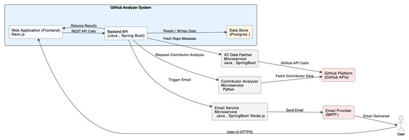
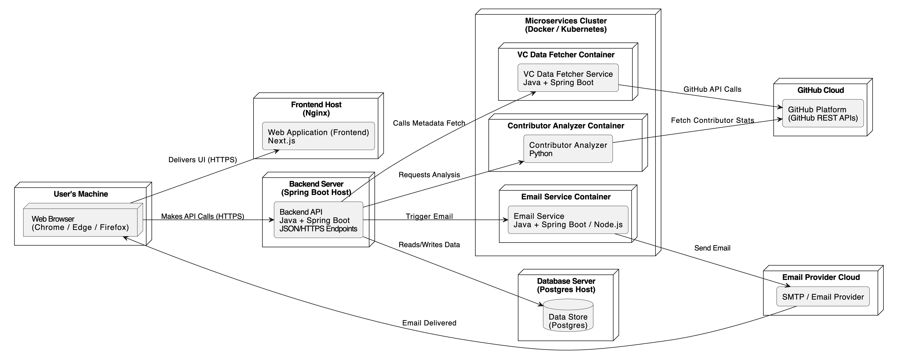

#  Dev Impact - GitHub Contribution Analyser
 
Dev Impact is a powerful microservice-based application designed to **analyze and quantify the impact and contribution of individual developers** within a given GitHub repository. By leveraging a microservices architecture, secure authentication, and AI-powered analysis, Dev Impact provides users with deep insights into their team's collective development effort.
 
##  Features
 
* **Secure Authentication:** Standard **Login/Register** flow with **JWT Authentication**.
* **GitHub OAuth Integration:** Securely obtain necessary tokens to access and analyze the user's private/public repositories.
* **Repository Analysis:** Users can input a GitHub repository URL for in-depth analysis.
* **Microservices Architecture:** A distributed system ensuring scalability, resilience, and maintainability.
* **AI-Powered Insights:** Uses **AI to analyze, summarize, and assess the overall impact** and contribution of each contributor.
* **Email Notifications:** Notifies the user via email once the complex analysis is complete.
* **Centralized Logging:** Utilizes **Kibana** for effective, centralized monitoring and debugging.
* **API Gateway:** Uses **Kong** as an API Router for unified access to the backend services.
 
---
 
##  Architecture and Microservices
 
Dev Impact is built upon a modular microservices architecture. The system is designed to decouple major functionalities, improving development agility and operational scalability.
 
###  Context Diagram
 
To understand how **Dev Impact** interacts with external entities (like the User and GitHub), the **Context Diagram** provides a high-level view of the system boundary.
 
****
 
---
 
### Deployment Diagram
 
The **Deployment Diagram** illustrates the physical arrangement of the services, showing where and how each microservice, the API Gateway, and the centralized logging are hosted.
 
****
 
---
 
###  Microservices Breakdown
 
| Service Name | Primary Functionality | Interactions | Technology Focus |
| :--- | :--- | :--- | :--- |
| **Main App Frontend** | User Interface and interaction point. | Communicates only with the **Main App Backend** (via Kong). | React/Vue/Angular (Placeholder) |
| **Main App Backend (JWT Backend)** | Handles **User Authentication (JWT)**, Stores **User Data** and **Analysis Results**. | Interacts with **Version Control Data Fetcher**, **Code Analyser Backend**, and **Email Sender**. | Core Logic, Data Persistence |
| **Version Control Data Fetcher** | Manages **GitHub OAuth** flow, checks user **Access Rights**, and fetches **Raw Repository Data** (commits, files, etc.). | Interacts with **GitHub API**. | External API Integration |
| **Code Analyser Backend** | Performs complex **Calculations** and uses **AI** to analyze, summarize, and determine contributor impact. | Requests raw data from the **Version Control Data Fetcher**. | Data Processing, AI/ML |
| **Email Sender** | Dedicated service for sending **Transactional Emails**, primarily notifying the user of completed analysis. | Triggered by the **Main App Backend**. | Email Protocol Handling (SMTP) |
| **Kong API Gateway** | Acts as the single entry point/router for the frontend to access the main backend. | Routes traffic to the **Main App Backend**. | API Routing, Load Balancing |
| **Kibana (Logging)** | Centralized platform for **Visualizing and Analysing Logs** from all microservices. | Receives logs from all services via a log shipper (e.g., Filebeat, Logstash). | Observability, Log Analytics |
 
---
 
##  Getting Started
 
### Port Configuration
 
The following table lists the default ports for each component. All external requests from the Frontend are routed through the **Kong API Gateway**.
 
| Component | Port | Purpose | Note |
| :--- | :--- | :--- | :--- |
| **Main App Frontend** | `3000` | User Interface | Captures User Interaction |
| **Kong API Gateway** | `8000`  | **Router Entry Point** | Frontend calls this port. Routes to Main App Backend. |
| **Main App Backend** | `8083`  | Core Backend / JWT Auth / Data Storage | Interacts with Frontend or with Kong. |
| **Version Control Data Fetcher** | `8081` | GitHub Data Retrieval | Internal use by Main App Backend/Analyser. |
| **Code Analyser Backend** | `8085` | AI Analysis and Calculation | Internal use by Main App Backend. |
| **Email Sender** | `8082` | Email Notification Service | Internal use by Main App Backend. |
| **Kibana** | `5601` | Centralized Logging Dashboard | For debugging and monitoring. |
 
---
 
## Limitations
 
While **Dev Impact** provides powerful analysis, users should be aware of the following potential limitations:
 
* **GitHub API Rate Limits:** The analysis relies on fetching a potentially large amount of data from the GitHub API, which has strict rate limits. High-volume analysis could be throttled.
* **Private Repository Access Scope:** The granted GitHub OAuth token only allows access to repositories the authenticated user is a part of. It cannot analyze repos the user doesn't have clone/read access to.
* **Analysis Time:** For very large repositories with extensive commit history, the **Code Analyser Backend** may take a significant amount of time to complete its processing and AI analysis.
* **AI Interpretation:** The quality and accuracy of the contribution summary and impact analysis are dependent on the training and sophistication of the integrated AI model. Edge cases or unconventional development patterns might be misinterpreted.
 
---
## Setup
 
For **Support and Setup** regarding the project, please refer the **[SUPPORT.md](https://github.com/BITSSAP2025AugAPIBP3Sections/APIBP-20242YA-Team-7/blob/main/SUPPORT.md)** file
 
---
 